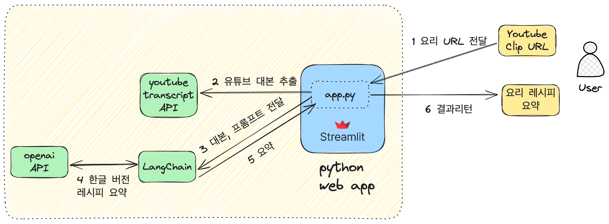

# [GENAI] Youtube recipe summary 간단 앱

<aside>
💡 유튜브 요리 클립으로부터 레시피와 재료를 추출하는 파이썬 앱을 만듭니다

</aside>

# 어플리케이션 논리 구성도



# 테스트 URL

- 아하 부장 김치 찌개 : [https://www.youtube.com/watch?v=7HI6pl9-6-U](https://www.youtube.com/watch?v=7HI6pl9-6-U)
- 고든 램지 버거 : [https://www.youtube.com/watch?v=7HI6pl9-6-U](https://www.youtube.com/watch?v=7HI6pl9-6-U)
- 백종원 요리비책 청국장 : [https://www.youtube.com/watch?v=wezbeu4-C2s](https://www.youtube.com/watch?v=wezbeu4-C2s)


# 데모 실행

git을 clone합니다.

```haskell
$ python3.8 -m venv youtube
$ source ~/youtube/bin/activate
(youtube) $ cd ~/youtube/
(youtube) $ git clone https://github.com/DevRico003/youtube_summarizer
(youtube) $ cd youtube_summarizer/
```

파이썬 package를 설치합니다.

```haskell
pip install --upgrade pip
pip install -r requirements.txt
```

app.py를 작성(수정) 합니다. 

한글로 변환하도록 프롬프트를 지정 합니다.

```haskell
import os
import openai
import streamlit as st
from youtube_transcript_api import YouTubeTranscriptApi
from langchain.text_splitter import RecursiveCharacterTextSplitter
 
OPENAI_API_key='xxxxxxxxxxxxxxxxxxxx'
openai.api_key=OPENAI_API_key

def get_transcript(youtube_url):
    video_id = youtube_url.split("v=")[-1]
    transcript_list = YouTubeTranscriptApi.list_transcripts(video_id)

    try:
        transcript = transcript_list.find_manually_created_transcript()
        language_code = transcript.language_code   
    except:
        try:
            generated_transcripts = [trans for trans in transcript_list if trans.is_generated]
            transcript = generated_transcripts[0]
            language_code = transcript.language_code   
        except:
            raise Exception("No suitable transcript found.")

    full_transcript = " ".join([part['text'] for part in transcript.fetch()])
    return full_transcript, language_code  # Return both the transcript and detected language

def summarize_with_langchain_and_openai(transcript, language_code, model_name='gpt-3.5-turbo'):
    text_splitter = RecursiveCharacterTextSplitter(chunk_size=2000, chunk_overlap=0)
    texts = text_splitter.split_text(transcript)
    text_to_summarize = " ".join(texts[:4]) # Adjust this as needed

    system_prompt = '쉬운말투로 요리와 레시피를 정리해줘.'
    prompt = f'''요리를 하기위한 재료와 레시피를 한글로 정리해줘.
    Text: {text_to_summarize}

    Add a title to the summary in {language_code}. 
    Include an INTRODUCTION, BULLET POINTS if possible, and a CONCLUSION in {language_code}.'''

    response = openai.ChatCompletion.create(
        model=model_name,
        messages=[
            {'role': 'system', 'content': system_prompt},
            {'role': 'user', 'content': prompt}
        ],
        temperature=1
    )
    
    return response['choices'][0]['message']['content']

def main():
    st.title('YouTube 레시피 요약')
    link = st.text_input('YouTube 링크를 넣으면 레시피를 요약해 줍니다:')

    if st.button('Start'):
        if link:
            try:
                progress = st.progress(0)
                status_text = st.empty()

                status_text.text('스크립트 추출 중...')
                progress.progress(25)

                transcript, language_code = get_transcript(link)

                status_text.text(f'요약 생성 중...')
                progress.progress(75)

                model_name = 'gpt-3.5-turbo'
                summary = summarize_with_langchain_and_openai(transcript, 'korean', model_name)

                status_text.text('레시피 요약:')
                st.markdown(summary)
                progress.progress(100)
            except Exception as e:
                st.write(str(e))
        else:
            st.write('YouTube 링크를 넣으세요.')

if __name__ == "__main__":
    main()
```

streamlit으로 실행합니다. 

```haskell
(youtube) $ streamlit run app.py

Collecting usage statistics. To deactivate, set browser.gatherUsageStats to False.

  You can now view your Streamlit app in your browser.

  Network URL: http://10.0.0.209:8501
  External URL: http://152.70.240.98:8501
```

# **streamlit은**

streamlit 은 python으로 데이터 분석을 위한 웹앱을 쉽게 만들어주는 라이브러리 입니다. 

아래는 공식 홈페이지의 예시 코드로 python 코드 몇 줄로 동작하는 웹 서비스를 만들 수 있습니다. 

deploy방법도 매우 쉬워서 누구나 쉽게 데모 웹을 만들 수 있습니다.


# 데모 화면

웹 앱을 실행하여 요리 유튜브 링크를 붙여넣으면, 레시피와 재료를 정리해 줍니다.

아래는 아하부장 김치찌개 레시피 요약 결과입니다.  


 
